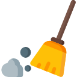
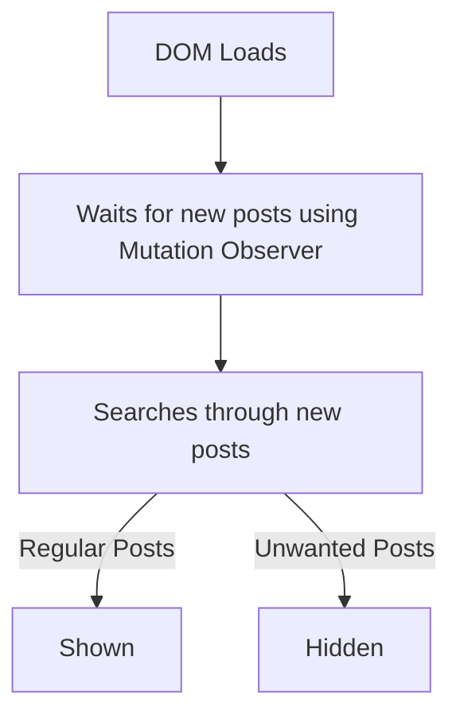

 

    

<h2 align="center">FB Iphone - Clean my feeds (UserScript)</h2>

[Greasy Fork](https://greasyfork.org/en/scripts/479868-fb-mobile-clean-my-feeds)

 

Hides Suggested and Unwanted posts from **Facebook Iphone** feed. Get a clean Newsfeeds with posts only from your friends, pages and groups you follow.

**⚠️ Works on Iphone Only**

### How to use

1. Download and install Userscripts on App Store https://apps.apple.com/xk/app/userscripts/id1463298887?platform=iphone
2. Follow Userscripts installation guide.
3. Inject "FB Iphone - Clean my feeds.user.js"

### Removes

- Suggested posts
- Sponsored posts
- Unlabeled posts containing "Follow" button
- Unlabeled posts containing "Join" button

### Languages Supported

- French

### How it works

 
⭐ If you like this project a Star would be nice.
⭐ You can request for new filters or submit issues here: [Github/issues](https://github.com/webdevsk/FB-Mobile-Clean-my-feeds/issues)
⭐ Want to contribute? Fork this repo and create a pull request here:
[Github/pulls](https://github.com/webdevsk/FB-Mobile-Clean-my-feeds/pulls)

_For PC browsers, use this instead: https://github.com/zbluebugz/facebook-clean-my-feeds_
